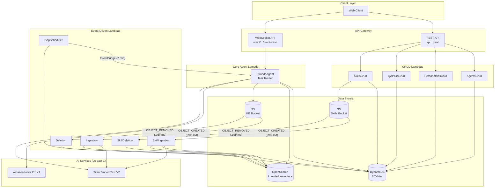

# Architecture Overview

This document covers the features built in the current version of the GMeet Agent platform. It does not cover the full project history — only the components implemented and refactored in this development cycle.

## High-Level Architecture



## Component Summary

| Component | Runtime | Trigger | Purpose |
|---|---|---|---|
| AgentsCrud | Python 3.11 | REST API | CRUD for agent configurations |
| PersonalitiesCrud | Python 3.11 | REST API | CRUD for personality prompts |
| QAPairsCrud | Python 3.11 | REST API | Read/delete QA pairs |
| SkillsCrud | Python 3.11 | REST API | CRUD for agent skill documents, pre-signed URL upload |
| StrandsAgent | Python 3.11 | WebSocket API | AI agent with task routing, transcript processing, question detection, skill search |
| Ingestion | Python 3.11 | S3 OBJECT_CREATED (KB Bucket) | PDF/Markdown text extraction, chunking, embedding, OpenSearch indexing |
| Deletion | Python 3.11 | S3 OBJECT_REMOVED (KB Bucket) | Remove OpenSearch vectors when source file is deleted |
| SkillIngestion | Python 3.11 | S3 OBJECT_CREATED (Skills Bucket) | Skill document text extraction, chunking, embedding, OpenSearch indexing with agent_id, status update |
| SkillDeletion | Python 3.11 | S3 OBJECT_REMOVED (Skills Bucket) | Remove skill vectors from OpenSearch (filtered by doc_type) |
| GapScheduler | Python 3.11 | EventBridge (every 2 min) | Trigger gap analysis for active sessions with new transcript data |

## Data Model

```mermaid
erDiagram
    AgentsTable {
        string agent_id PK
        string agent_name
        string role_prompt
        string task_prompt
        string personality_id FK
        string model_id
        string use_case
        string createdAt
        string updatedAt
    }

    PersonalitiesTable {
        string personality_id PK
        string personality_name
        string personality_prompt
        string createdAt
        string updatedAt
    }

    SessionsTable {
        string session_id PK
        string project_id
        string is_active
        string connection_id
        string last_activity_at
        string last_transcript_update_at
        string last_gap_analysis_at
    }

    TranscriptsTable {
        string transcript_id PK
        string session_id GSI
        string speaker
        string speaker_role
        string text
        string timestamp
    }

    QAPairsTable {
        string qa_pair_id PK
        string session_id GSI
        string project_id GSI
        string question
        string answer
        string source
        string created_at
    }

    SuggestedQuestionsTable {
        string question_id PK
        string session_id GSI
        string question_text
        list embedding
        boolean matched
        string created_at
    }

    ProjectsTable {
        string project_id PK
    }

    SkillsTable {
        string skill_id PK
        string agent_id GSI
        string skill_name
        string description
        string s3_key
        string file_type
        string status
        string createdAt
        string updatedAt
    }

    AgentsTable ||--o| PersonalitiesTable : "personality_id"
    AgentsTable ||--o{ SkillsTable : "agent_id"
    SessionsTable ||--o{ TranscriptsTable : "session_id"
    SessionsTable ||--o{ QAPairsTable : "session_id"
    SessionsTable ||--o{ SuggestedQuestionsTable : "session_id"
```

## Shared Lambda Layers

All Lambdas share a common set of layers to reduce code duplication:

| Layer | Contents | Used By |
|---|---|---|
| shared | `response_utils.py`, `custom_exceptions.py` | CRUD Lambdas |
| powertools | `aws-lambda-powertools` (Logger, Tracer) | All Lambdas |
| opensearch | `opensearchpy`, `requests-aws4auth` | StrandsAgent, Ingestion, Deletion |
| strands | `strands-agents`, `strands-agents-tools` | StrandsAgent |
| pypdf2 | `PyPDF2` | Ingestion |

## Observability

All Lambdas use AWS Lambda Powertools for structured logging and X-Ray tracing:

- `Logger()` produces structured JSON logs in CloudWatch
- `Tracer()` with `@tracer.capture_lambda_handler` and `@tracer.capture_method` decorators provide full X-Ray call chains
- All Lambdas have `tracing=ACTIVE` enabled in CDK

## Standard Response Envelope

All REST API responses follow this format:

```json
{
  "statusCode": 200,
  "status": true,
  "message": "Human-readable message",
  "data": {}
}
```

Error responses set `status: false` and include the error message. CORS headers are included on all responses.
