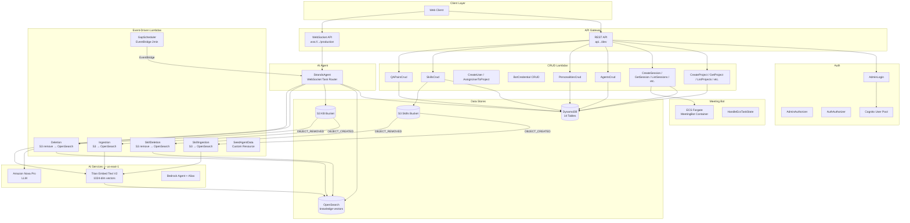

# Architecture Overview

AI-powered meeting intelligence platform combining meeting management (projects, sessions, bot dispatch) with a real-time AI agent engine (knowledge base search, live transcript processing, gap analysis, retrospective coaching).

## System Diagram



## Stack Composition

| Stack | Resources | Region |
|---|---|---|
| `AXRAIL-DynamoDB-{env}` | 14 DynamoDB tables, 1 OpenSearch domain | ap-southeast-1 |
| `AXRAIL-Cognito-{env}` | User Pool, App Client, Admin/User groups | ap-southeast-1 |
| `AXRAIL-MeetingBot-{env}` | ECS Cluster, Task Definition, VPC, SQS queue | ap-southeast-1 |
| `AXRAIL-Lambda-{env}` | 48 Lambda functions, 5 layers, WebSocket API, 2 S3 buckets, EventBridge rule, Custom Resources | ap-southeast-1 |
| `AXRAIL-ApiServices-{env}` | REST API Gateway, routes, Cognito authorizers | ap-southeast-1 |
| `AXRAIL-BedrockAgent-{env}` | Bedrock Agent (Nova Pro), Agent Alias, test Lambda | us-east-1 |

> **Note:** `AXRAIL-ApiServices-{env}` includes the `/files/download` route for pre-signed S3 download URLs.

Stack dependency order: DynamoDB → Cognito → MeetingBot → Lambda → ApiServices (BedrockAgent is independent).

## Lambda Functions

### REST API Handlers

| Function | Route | Auth | Description |
|---|---|---|---|
| AdminLogin | `POST /auth/admin/login` | None | Cognito authentication, returns JWT |
| CreateProject | `POST /projects` | Admin | Create project |
| GetProject | `GET /projects/{projectId}` | Admin | Get project by ID |
| ListProjects | `GET /projects` | Admin | List all projects |
| UpdateProject | `PUT /projects/{projectId}` | Admin | Update project |
| DeleteProject | `DELETE /projects/{projectId}` | Admin | Delete project |
| CreateSession | `POST /sessions` | Admin+User | Create session + dispatch bot |
| GetSession | `GET /sessions/{sessionId}` | Admin+User | Get session by ID |
| ListSessions | `GET /sessions` | Admin+User | List sessions |
| UpdateSession | `PUT /sessions/{sessionId}` | Admin+User | Update session |
| DeleteSession | `DELETE /sessions/{sessionId}` | Admin | Delete session |
| AgentsCrud | `GET/POST/PUT/DELETE /agents` | Admin | Agent configuration CRUD |
| PersonalitiesCrud | `GET/POST/PUT/DELETE /personalities` | Admin | Personality prompt CRUD |
| SkillsCrud | `GET/POST/PUT/DELETE /skills` | Admin | Skill document CRUD + S3 upload |
| QAPairsCrud | `GET/DELETE /qa-pairs` | Admin | QA pair read/delete |
| KbDocumentsCrud | `GET/POST/DELETE /projects/{projectId}/kb-documents` | Admin | KB document CRUD |
| FileDownload | `GET /files/download` | Admin+User | Generate pre-signed S3 download URLs |
| GetSessionSummary | `GET /sessions/{sessionId}/summary` | Admin+User | Get meeting summary |
| GetSuggestedQuestions | `GET /sessions/{sessionId}/suggested-questions` | Admin+User | Get suggested questions |
| CreateUser | `POST /users` | Admin | Create Cognito user |
| ChangePassword | `POST /auth/change-password` | User | Change password |
| Logout | `POST /auth/logout` | User | Invalidate tokens |

### WebSocket Handlers

| Function | Trigger | Description |
|---|---|---|
| StrandsAgent | WebSocket API (11 routes) | AI agent with KB search, transcript processing, gap analysis, retro mode |

### Event-Driven

| Function | Trigger | Description |
|---|---|---|
| Ingestion | S3 OBJECT_CREATED (KB bucket) | Extract text, embed, index to OpenSearch |
| Deletion | S3 OBJECT_REMOVED (KB bucket) | Remove vectors from OpenSearch |
| SkillIngestion | S3 OBJECT_CREATED (Skills bucket) | Skill document ingestion |
| SkillDeletion | S3 OBJECT_REMOVED (Skills bucket) | Remove skill vectors |
| GapScheduler | EventBridge (every 2 min) | Trigger gap analysis for active sessions |
| SeedAgentData | CloudFormation Custom Resource | Seed initial agent/personality data |
| HandleEcsTaskState | EventBridge (ECS state change) | Update session bot_status |

## Shared Lambda Layers

| Layer | Contents | Used By |
|---|---|---|
| SharedLayer | `response_utils`, `custom_exceptions`, `auth_utils` | All CRUD Lambdas |
| PowertoolsLayer | `aws-lambda-powertools` (Logger, Tracer) | All Lambdas |
| OpenSearchLayer | `opensearchpy`, `requests-aws4auth` | StrandsAgent, Ingestion, Deletion |
| StrandsLayer | `strands-agents`, `strands-agents-tools` | StrandsAgent |
| PyPDF2Layer | `PyPDF2`, `python-docx` | Ingestion, SkillIngestion |

## Observability

All Lambdas use AWS Lambda Powertools:

- Structured JSON logging via `Logger()` in CloudWatch
- X-Ray tracing via `Tracer()` with `@tracer.capture_lambda_handler` and `@tracer.capture_method`
- All Lambdas have `tracing=ACTIVE` in CDK

## Response Envelope

All REST API responses follow this format:

```json
{
  "statusCode": 200,
  "status": true,
  "message": "Human-readable message",
  "data": {}
}
```

Error responses set `status: false`. CORS headers are included on all responses.
