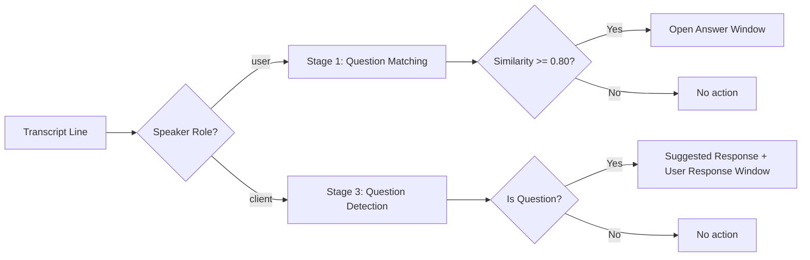

# Live Transcript Processing

## Overview

The `processTranscript` WebSocket action handles real-time meeting transcript lines. It classifies speakers, stores transcript entries, matches questions against pre-set topics, detects client questions, and captures answers automatically.

## Speaker Classification

When transcript lines arrive, speakers need to be classified as `"user"` (the meeting host/presenter) or `"client"` (the external participant).

Two methods are available:

1. **Speaker hints** (recommended) — The client sends a `speaker_hint` map with each `processTranscript` call. This is instant and deterministic.

2. **Model classification** — If no hints are provided and no role map exists, Nova Pro analyzes the transcript context to infer roles. Returns a confidence level (`"high"` or `"low"`).

Speaker hints should be sent on every `processTranscript` call. Role maps are cached in Lambda memory but are lost on cold starts or when requests hit different Lambda instances.

## Three-Stage QA Pipeline

### Stage 1: Suggested Question Matching

Before the meeting, call `setSuggestedQuestions` to store questions with embeddings. During the transcript, each user-spoken line is embedded and compared against unmatched questions using cosine similarity.

Threshold: **0.80** (configurable in `constants.py` as `MATCH_THRESHOLD`)

### Stage 2: Answer Window Capture

When a question is matched, an answer window opens to capture the client's response. Close conditions:
- 5 client lines collected
- Speaker turn change (user speaks while client lines exist)
- 60-second timeout

Captured QA pairs are saved with `source: "participant"`.

### Stage 3: Client Question Detection

Client lines are checked for questions using a two-tier approach:

1. **Heuristic check** — Ends with `?` or starts with an interrogative word (`what`, `how`, `why`, `when`, `where`, `who`, `which`, `can you`, `could you`, etc.)
2. **Model check** — If heuristics are inconclusive, Nova Pro classifies the text

Filter: Lines shorter than 5 words are skipped to avoid false positives.

When a client question is detected:
- A `clientQuestionDetected` message is sent
- A suggested response is generated from the knowledge base
- A user response window opens to capture the host's verbal answer (saved with `source: "client"`)

## Transcript Storage

All classified transcript lines are batch-written to the TranscriptsTable with fields: `transcript_id`, `session_id`, `speaker`, `speaker_role`, `text`, `timestamp`.

A rolling buffer of the last 50 lines is maintained in memory for context.

## Known Limitation

The answer window and user response window state is ephemeral (in-memory). If the Lambda cold-starts between transcript batches, open windows are lost. For reliable capture, send the question and expected answer lines in the same `processTranscript` batch when possible. A future enhancement could persist window state in DynamoDB.
