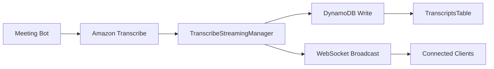
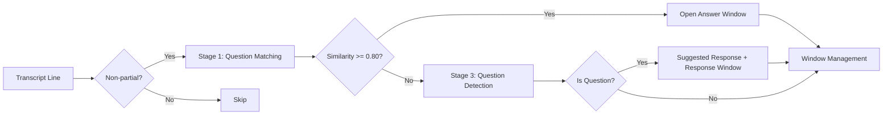

# Live Transcript Processing

## Overview

The live transcript system provides real-time transcript streaming from meeting bots to connected WebSocket clients. When the bot captures audio and transcribes it, each transcript line is simultaneously:
1. Saved to DynamoDB (TranscriptsTable)
2. Broadcast to connected WebSocket clients in real-time

## Real-Time Transcript Broadcast

### Architecture



### WebSocket Message Format

When a transcript line is captured, clients receive:

```json
{
  "type": "transcriptLine",
  "line": {
    "session_id": "abc123",
    "transcript_id": "uuid-here",
    "text": "Hello, welcome to the meeting.",
    "speaker": "spk_0",
    "start_time": "10.25",
    "end_time": "12.50",
    "confidence": "0.923",
    "timestamp": "2025-01-15T10:30:15.123Z",
    "is_partial": false,
    "created_at": "2025-01-15T10:30:15.123Z"
  }
}
```

The `line` object contains the exact same data structure that is stored in DynamoDB, ensuring consistency between real-time and historical data.

### Frontend Integration

```javascript
// Connect to WebSocket with session_id
const ws = new WebSocket('wss://{api-id}.execute-api.{region}.amazonaws.com/production?session_id=abc123');

ws.onmessage = (event) => {
  const data = JSON.parse(event.data);
  
  if (data.type === 'transcriptLine') {
    // Real-time transcript line from bot
    const line = data.line;
    console.log(`[${line.speaker}] ${line.text}`);
    // Update UI with new transcript line
  }
};
```

## processTranscript WebSocket Action

The `processTranscript` WebSocket action handles transcript lines sent by external callers (not the bot). It processes all incoming lines, performs speaker role classification (see [Speaker Role Classification](speaker-role-classification.md)), stores transcript entries, matches questions against pre-set topics, detects questions, and captures answers automatically.

## Speaker Role Classification

Single-channel audio produces a single speaker label (`spk_0`) for all lines. The pipeline uses Cohere Embed v3 on Bedrock to classify each line's `speaker_role`:

- **Single-speaker path** — All lines share the same speaker label. Cohere Embed v3 embeds each line and compares it via cosine similarity against pre-computed role exemplar centroids to assign `"user"` or `"client"`.
- **Multi-speaker path** — When 2+ distinct speaker labels exist, Nova Pro classifies labels to roles in a single fast-path call. A `speakerRoles` message is broadcast on the first batch.
- **Latency** — Exemplar centroids are computed once per session (~500ms). Each subsequent line is one embed call (~100-200ms) + cosine similarity.
- **Fallback** — On error, the role defaults to `"unknown"`, which still triggers suggested responses (safe default).

For full details, see [Speaker Role Classification](speaker-role-classification.md).

## Three-Stage QA Pipeline



### Stage 1: Suggested Question Matching

Before the meeting, call `setSuggestedQuestions` to store questions with embeddings. During the transcript, each non-partial line is embedded and compared against unmatched questions using cosine similarity.

Threshold: **0.80** (configurable in `constants.py` as `MATCH_THRESHOLD`)

### Stage 2: Answer Window Capture

When a question is matched, an answer window opens to capture subsequent lines as the answer. Close conditions:
- 5 lines collected
- New question detected in an incoming line
- 60-second timeout

Captured QA pairs are saved with `source: "participant"`.

### Stage 3: Question Detection

All non-partial lines are checked for questions using a two-tier approach:

1. **Heuristic check** — Ends with `?` or starts with an interrogative word (`what`, `how`, `why`, `when`, `where`, `who`, `which`, `can you`, `could you`, etc.)
2. **Model check** — If heuristics are inconclusive, Nova Pro classifies the text

Filter: Lines shorter than 5 words are skipped to avoid false positives.

When a question is detected:
- A `questionDetected` message is sent (includes `speaker` and `speaker_role` fields)
- A suggested response is generated from the knowledge base only for `speaker_role` `"client"` or `"unknown"` (NOT for `"user"`)
- A response window opens to capture the verbal answer that follows (saved with `source: "participant"`)

The response window follows the same close conditions as the answer window (5 lines / new question detected / 60s timeout).

## Transcript Storage

All transcript lines are batch-written to the TranscriptsTable with fields: `transcript_id`, `session_id`, `speaker`, `text`, `timestamp`, `start_time`, `end_time`, `confidence`, `is_partial`.

> **Note:** The `speaker_role` field IS now populated by the processing pipeline using Cohere Embed v3 speaker classification. See [Speaker Role Classification](speaker-role-classification.md) for details.

A rolling buffer of the last 50 lines is maintained in memory for context.

## QA Event Broadcasting

The following events are broadcast to ALL WebSocket connections on the same session, not just the caller:
- `questionDetected`
- `suggestedResponse`
- `qaPairAutoSaved`
- `questionUnanswered`

This ensures all participants connected to a session see real-time QA activity.

## Known Limitation

The answer window and user response window state is ephemeral (in-memory). If the Lambda cold-starts between transcript batches, open windows are lost. For reliable capture, send the question and expected answer lines in the same `processTranscript` batch when possible. A future enhancement could persist window state in DynamoDB.
