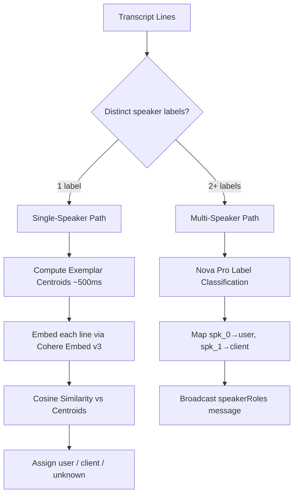

# Speaker Role Classification

## Overview

Single-channel audio from meeting bots produces a single speaker label (`spk_0`) for all transcript lines, making it impossible to distinguish who said what. Speaker role classification assigns each line a `speaker_role` of `"user"`, `"client"`, or `"unknown"` so the platform can:

- Generate suggested responses only for client/unknown questions (not the user's own)
- Include `speaker_role` in `questionDetected` messages for UI display
- Provide richer context for meeting summaries and retro analysis

## Architecture

## Classification Paths

### Single-Speaker (Cohere Embed v3 per-line)

When all lines share the same speaker label:

1. **Exemplar centroids** — On the first batch, 10 user exemplars and 10 client exemplars are embedded via Cohere Embed v3 on Bedrock. The mean of each set produces a user centroid and a client centroid. This runs once per session (~500ms).
2. **Per-line classification** — Each non-partial line is embedded (~100-200ms) and compared against both centroids using cosine similarity. The closer centroid determines the role.
3. **Threshold** — If neither centroid is sufficiently close, the line is assigned `"unknown"`.

### Multi-Speaker (Nova Pro fast path)

When 2+ distinct speaker labels exist in the transcript:

1. Nova Pro classifies each speaker label to a role (`"user"` or `"client"`) in a single LLM call.
2. A `speakerRoles` message is broadcast to all session connections on the first batch.
3. Subsequent lines are assigned roles based on the label→role mapping without additional model calls.

## Default Exemplars

The classifier uses 10 pre-defined exemplar sentences per role:

- **User exemplars** — Statements typical of the meeting host/seller (e.g., product descriptions, pricing explanations, feature walkthroughs)
- **Client exemplars** — Statements typical of the prospect/buyer (e.g., requirement questions, budget concerns, timeline inquiries)

Exemplars are defined in `constants.py` and can be customized per deployment.

## Latency

| Phase | Latency | Frequency |
|---|---|---|
| Exemplar centroid computation | ~500ms | Once per session |
| Per-line embed + cosine similarity | ~100-200ms | Each non-partial line |
| Multi-speaker Nova Pro classification | ~500-800ms | Once per session |

## Fallback Behavior

On any classification error (Bedrock timeout, model error, etc.), the line is assigned `speaker_role: "unknown"`. This is a safe default because:

- Suggested responses ARE generated for `"unknown"` questions
- No information is lost — the transcript is still stored
- The UI can display "unknown" gracefully

## Impact on Pipeline

- **Selective suggested responses** — `suggestedResponse` messages are only generated for `speaker_role` `"client"` or `"unknown"`, not `"user"`. This prevents the platform from suggesting answers to the user's own statements.
- **`questionDetected` messages** — Now include `speaker` and `speaker_role` fields for UI display.
- **QA event broadcasting** — All QA events are broadcast to all session connections. See [Live Transcript Processing](live-transcript-processing.md#qa-event-broadcasting).
